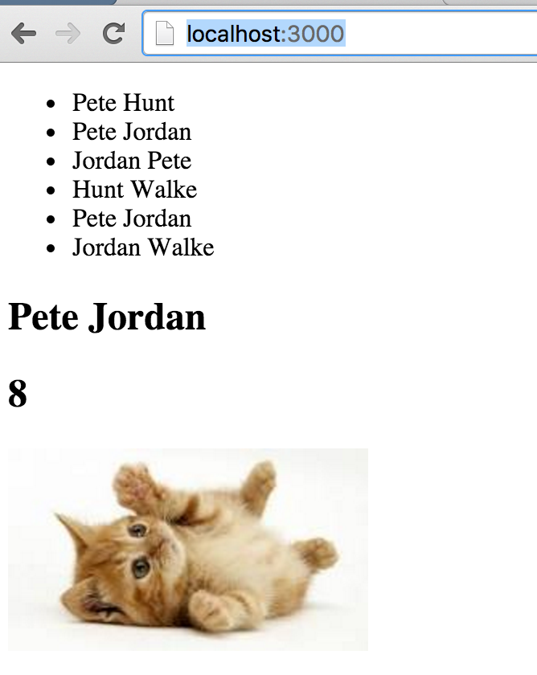

# Flux CatClicker Example

> An application architecture for React utilizing a unidirectional data flow.

This is what a running Flux CatClicker example looks like:


## How to Install  App
  

 -  Clone the GIT Repo
 - npm install 
 -  start server [node server.js ]


## How to Change the App
  - Clone the GIT Repo
  -  npm start [This will build and the output is bundle.js]

## App Structure
```
<CatClickerApp> 
 <CatList>
  <CatSelector></CatSelector>
 </CatList>
 <CatDetail></CatDetail>
</CatClickerApp> 
```

##  Data Flow

### Intial Load of Data from Server 

The primary entry point into the application is app.js.  This file bootstraps the React rendering inside of index.html.  CatClickerApp.react.js is our controller-view and it passes all data down into its child React components.

- In CatClickerApp CatWebAPIUtils.getAllMessages() is called to load data from server.  

- CatWebAPIUtils.getAllMessages() , on sucessfull load of data from server the CatServerActionCreators.receiveAll(catData) is called to create Actions, these actions will be dispacted to APPDispacther

- The App Dispacther will invoke the registerd store callback , in this case CatStore with Action type of ActionTypes.RECEIVE_RAW_MESSAGES

- The Action of type ActionTypes.RECEIVE_RAW_MESSAGES will update the array in stroe _cats with data from server 

- Post update of array _cats , an emit event "change" will be triggred. 

- The view listeing to change event will update the state with current values from store 

### On Click of any Names 

- The onClick will trigger handleClick function in the component CatSelector, which will create a action ActionTypes.CAT_DETAIL
 
- The App Dispacther will invoke the registerd store callback , in this case CatStore with Action type of ActionTypes.CAT_DETAIL

- The numberOfClicks will be updated for the Cat object in _cats array and also update the _currentCatIndex
 
- The view listeing to change event will update the state with current values from store 


### A Single Dispatcher


### Stores


### Views and Controller-Views


### Actions and Action Creators


### What About that Dispatcher?


## CatClicker Project Breakdown


<pre>
./
  index.html
  js/
    actions/
      CatServerActionCreators.js
    app.js
    bundle.js
    dispatcher/
      AppDispatcher.js
    components/
      CatClickerApp.react.js
      CatDetail.react.js
      CatList.react.js
      CatSelector.react.js
     stores/
      CatStore.js
     utils/
      CatWebAPIUtils.js 
</pre>

The primary entry point into the application is app.js.  This file bootstraps the React rendering inside of index.html.  CatClickerApp.react.js is our controller-view and it passes all data down into its child React components.

CatServerActionCreators.js is a collection of action creator methods that views may call from within their event handlers, in response to user interactions.  They are nothing more than helpers that call into the AppDispatcher.

Dispatcher.js is a base class for AppDispatcher.js which extends it with a small amount of application-specific code.

CatStore.js is our only store.  It provides all of the application logic and  storage.  Based on EventEmitter from Node.js, it emits "change" events after responding to actions in the callback it registers with the dispatcher.

CatWebAPIUtils makes the calls to web server , which will serve the data.

The bundle.js file is automatically genenerated by the build process, explained below.


## Running

You must have [npm](https://www.npmjs.org/) installed on your computer.
From the root project directory run these commands from the command line:

    npm install

This will install all dependencies.

To build the project, first run this command:

    npm start

This will perform an initial build and start a watcher process that will update bundle.js with any changes you wish to make.  This watcher is based on [Browserify](http://browserify.org/) and [Watchify](https://github.com/substack/watchify), and it transforms React's JSX syntax into standard JavaScript with [Reactify](https://github.com/andreypopp/reactify).

To run the app, spin up an HTTP server[node server.js ] and visit http:http://localhost:3000/.  


## Credit

This CatClickerFlux application was created by [Jerry Kuru]


## License
Flux is BSD-licensed. We also provide an additional patent grant.
